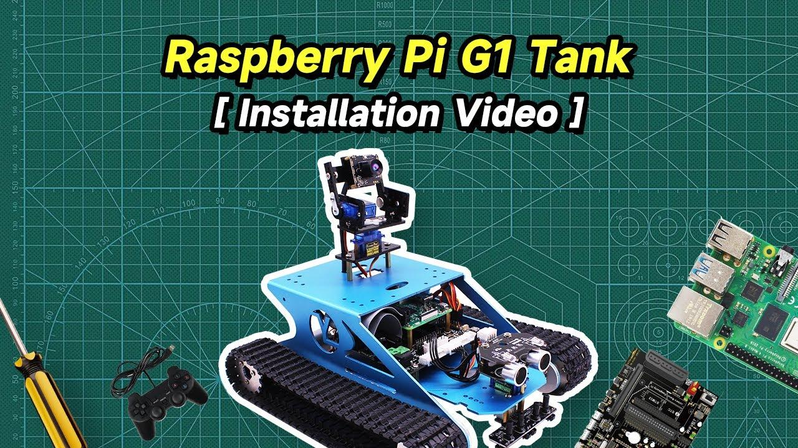
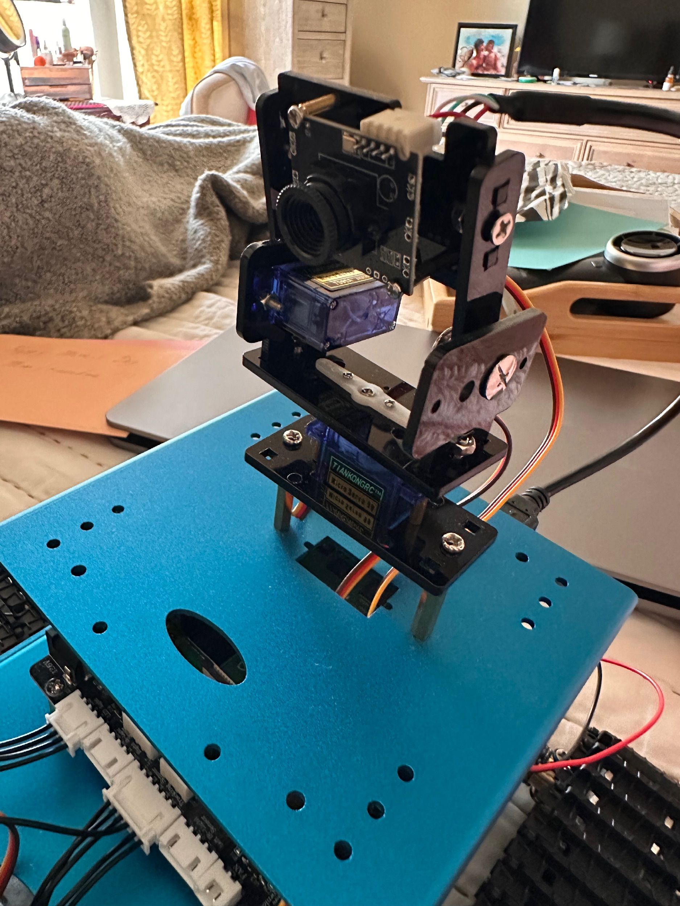
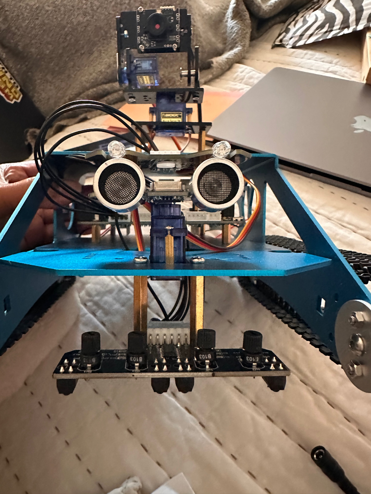

# Yahboom G1 Tank — Kit Assembly Tips for Helpers

This document is a companion to the Yahboom assembly video. Watch the video and use these tips as a reference during assembly. The tips focus on the specific gotchas discovered during the kit build — things the video does not emphasize or gets wrong.

> ⚠ **Ignore the Raspberry Pi install part of the video.** The Pis are at the school and will be added later. Assemble everything else. When you're done you'll have the top assembly and the bottom assembly. Leaving them separate will make it easier to install the Pis at the school.

Assembly goes a lot smoother when you have room to spread out. If you can, claim a big table — a folding table, a kitchen table, anything with enough surface area to lay all the components out at once before you start. Keeping parts organized and visible means you spend less time hunting through bags and more time actually building. Group small hardware (screws, standoffs, nuts) in separate piles or small cups so they don't roll away or get mixed up. You will thank yourself later when you are trying to find one specific screw size with both hands already occupied holding a bracket.

## Before You Start

### Supply Check

Before opening any bags, verify you have all components. Check each item off as you confirm it.

- [ ] Blue aluminum chassis (top and bottom plates) — 1 top, 1 bottom
- [ ] 370 DC motors — 2
- [ ] High-quality rubber tracks — 2
- [ ] 4WD expansion board — 1
- [ ] Battery pack (18650-3S, 11.1V) — 1
- [ ] Battery charger — 1
- [ ] HD USB camera — 1
- [ ] Camera servos — 2
- [ ] Ultrasonic sensor module — 1
- [ ] 4-channel line tracking module — 1
- [ ] RGB LED module — 1
- [ ] Bluetooth module — 1
- [ ] 6-pin sensor cables (extras available if short) — 2+
- [ ] Screwdriver (Phillips) — 1

### Tools Needed

- Phillips head screwdriver (small)
- Your hands — no soldering required
- Patience — lotta patience — some screws are fiddly

### Installation/Assembly Video

This video is so much better than the original. It will help you tremendously especially with the camera assembly.

### General Tips

- The new manual that comes with the kit is also much better. You will skip steps 19 and 22. Those are the steps to attach the Raspberry Pi (19) and attach the chassis (22).
- When you are complete you will have 2 pieces: the top with the camera mounted, the bottom with motor and wheels attached. The bottom piece will have the expansion board, RGB, and ultrasonic sensors attached.
- Orientation matters. Especially with the servos. Pay special attention to the wire side in the videos.
- Don't force anything to fit. If it seems misaligned or off, recheck the orientation. Defect is also a possibility. If you suspect something is defective, text or call to let someone know.
- Pins bend easily so again don't force anything. For any wiring, ensure connectors are aligned before applying pressure. The connectors on this kit don't give a nice click when the connection is made. It's ok to skip the wiring since we don't have the Pis.
- Each servo has a shaft that the horn attaches to. The shaft has a specific neutral (center) position. You must find neutral before attaching the horn.

> **CHECKPOINT:** Bottom assembly complete. Before moving on: tracks roll freely, all cables seated, power switch OFF, GPIO header empty.

## Part 1: Top Assembly — Motor, Tracks, Camera and Pan/Tilt

The top assembly is primarily the camera. The camera pan/tilt mechanism has two servos that must be oriented correctly before attaching the horn. Getting this wrong is the most common assembly mistake. Watch the video section on camera assembly carefully, then use these tips.

### Motors and Chassis

- Mount the two 370 motors into the chassis motor brackets using the provided screws.
- Attach the metal couplings to each motor shaft. These connect the motor to the drive wheel.
- Thread the rubber tracks around the drive wheels and idler wheels. This takes some patience — work the track around gradually rather than forcing it all at once. Be careful, it is possible to damage the track.

> **TIP:** The tracks have a specific orientation. Look for a slight taper or texture direction and keep it consistent on both sides.

*Camera and Pan/Tilt Bracket*

> **TIP:** Leave enough cable slack for the pan/tilt to move through its full range. Too tight and it will pull the camera out of position.

*What the camera looks like fully assembled.*

## Part 2: Bottom Assembly

The bottom assembly includes ultrasonic, RGB, and expansion board. Follow the assembly video for the step-by-step sequence.

### Expansion Board

- Mount the copper standoff posts to the chassis plate in the four Pi mounting positions.
- The expansion board mounts on top of the standoffs. It should sit level with no rocking.
- Secure with screws but do not overtighten — the board is PCB and will crack.
- Pay attention to the position of the expansion board mount on the bottom chassis. It should allow for the front connectors to be accessible to the wiring.

### RGB and Ultrasonic

- The servo for this assembly will need 180 degrees range of motion. Ensure the orientation and range before completing the assembly.

*RGB and ultrasonic servo — reference photo.*

> **CHECKPOINT:** Bottom assembly complete. Before moving on: tracks roll freely, all cables seated, power switch OFF, GPIO header empty.

## Final Check

Before considering a kit complete, verify every item on this list.

- [ ] Both tracks fully attached to motors
- [ ] Camera pan/tilt servo horns attached at correct center position
- [ ] Camera mounted securely on tilt arm
- [ ] USB camera cable has enough slack for full pan/tilt range
- [ ] Ultrasonic sensor mounted and cable connected
- [ ] No cables pinched between top and bottom chassis
- [ ] All screws tightened (not overtightened on PCB)

## Notes

Use this space to document anything unusual about a specific kit — a stripped screw, a cable that seemed short, anything that did not go exactly as expected.

| Kit # | Notes |
|---|---|
| Kit 1 | |
| Kit 2 | |
| Kit 3 | |
| Kit 4 | |
| Kit 5 | |

---

Questions? Contact Mekka.
